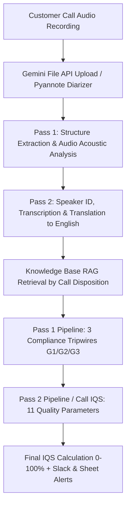

# Wint Wealth Call Evaluation: Parameters, Prompts & Execution Specifications

This document provides a comprehensive reference for **all call evaluation parameters, scoring criteria, weights, and the exact prompts used** across the Wint Wealth IR Portal call scoring and audio intelligence engines.

---

## Table of Contents
1. [Architecture & Evaluation Flow Overview](#1-architecture--evaluation-flow-overview)
2. [Call Quality Evaluation Parameters (11-Parameter IQS)](#2-call-quality-evaluation-parameters-11-parameter-iqs)
   - [Parameter Breakdown & Weights](#parameter-breakdown--weights)
   - [Scoring Criteria (Yes / No / NA)](#scoring-criteria-yes--no--na)
   - [IQS Mathematical Formulation](#iqs-mathematical-formulation)
3. [Compliance Tripwire Gates (Pass 1 in Call Pipeline)](#3-compliance-tripwire-gates-pass-1-in-call-pipeline)
4. [Granular 10-Parameter Scoring (Pass 2 in Call Pipeline)](#4-granular-10-parameter-scoring-pass-2-in-call-pipeline)
5. [Acoustic & Tone Dimensions (Two-Pass Audio Analyzer)](#5-acoustic--tone-dimensions-two-pass-audio-analyzer)
6. [Prompts Inventory (Complete Prompt Texts)](#6-prompts-inventory-complete-prompt-texts)
   - [Prompt 1: Audio Transcription & Turn Structuring (`CALL_TRANSCRIPTION_PROMPT`)](#prompt-1-audio-transcription--turn-structuring-call_transcription_prompt)
   - [Prompt 2: Call IQS System Prompt (`CALL_IQS_SYSTEM_PROMPT`)](#prompt-2-call-iqs-system-prompt-call_iqs_system_prompt)
   - [Prompt 3: Runtime Call Scoring Prompt (`buildCallScoringPrompt`)](#prompt-3-runtime-call-scoring-prompt-buildcallscoringprompt)
   - [Prompt 4: Audio Energy & Tone Modulator (`ENERGY_TONE_PROMPT`)](#prompt-4-audio-energy--tone-modulator-energy_tone_prompt)
   - [Prompt 5: Loose Topic Extractor (`CALL_DISPOSITION_PROMPT`)](#prompt-5-loose-topic-extractor-call_disposition_prompt)
   - [Prompt 6: Constrained Taxonomy Classifier (`CALL_DISPOSITION_CLASSIFY_PROMPT`)](#prompt-6-constrained-taxonomy-classifier-call_disposition_classify_prompt)
   - [Prompt 7: Call Chunking & Retrieval Splitter (`CALL_CHUNK_PROMPT`)](#prompt-7-call-chunking--retrieval-splitter-call_chunk_prompt)
   - [Prompt 8: Two-Pass Analyzer — Pass 1 Structure (`PASS1_PROMPT`)](#prompt-8-two-pass-analyzer--pass-1-structure-pass1_prompt)
   - [Prompt 9: Two-Pass Analyzer — Pass 2 Content & Tone (`buildPass2Prompt`)](#prompt-9-two-pass-analyzer--pass-2-content--tone-buildpass2prompt)
   - [Prompt 10: Critical Gates Compliance Auditor (`CALL_GATES_SYSTEM_PROMPT`)](#prompt-10-critical-gates-compliance-auditor-call_gates_system_prompt)
   - [Prompt 11: Pipeline IQS Pass System Prompt (`CALL_IQS_PASS_SYSTEM_PROMPT`)](#prompt-11-pipeline-iqs-pass-system-prompt-call_iqs_pass_system_prompt)
   - [Prompt 12: Bot Flag Failure Summarizer (`generateBotChatSummary`)](#prompt-12-bot-flag-failure-summarizer-generatebotchatsummary)
7. [Technical Runtime & LLM Call Execution Parameters](#7-technical-runtime--llm-call-execution-parameters)

---

## 1. Architecture & Evaluation Flow Overview

Call evaluation in the portal operates across two complementary sub-systems:
1. **Interactive Call Quality Engine (`lib/call-quality.ts`)**: Evaluates recorded calls against an **11-parameter rubric** spanning Process (50%), Communication Skills (30%), and Customer Service Skills (20%), computing an aggregate IQS (0–100%).
2. **Two-Pass & Automated Call Pipeline (`lib/call-analyzer.ts` & `lib/scoring/call-pipeline.ts`)**:
   - **Structure Pass**: Identifies speaker turns, speech pauses $\ge 2.0$s (dead air vs hold), and conversational overlaps.
   - **Compliance Tripwires**: Audits regulatory gates (No Investment/Tax Advice, No Fabricated Facts, Identity/Data Privacy).
   - **Quality Scoring Pass**: Computes 0/1/2/NA marks against verified Knowledge Base (KB) chunks, pre-call chat history, and prior call context.



---

## 2. Call Quality Evaluation Parameters (11-Parameter IQS)

Source of truth: [`lib/call-quality.ts`](file:///Users/admin/Documents/WintWealth/wint-ir-portal/lib/call-quality.ts).

### Parameter Breakdown & Weights

| Group | Key | Display Label | Weight | Purpose |
| :--- | :--- | :--- | :---: | :--- |
| **Process (50%)** | `CallOpening` | Call Opening | **5%** (0.05) | Verifies agent introduces themselves with name + "Wint Wealth" in under 5 seconds. |
| | `CallClosing` | Call Closing | **5%** (0.05) | Verifies professional wrap-up, query re-check, and day greeting. |
| | `TechnicalLegal` | Technically / Legally Correct | **15%** (0.15) | Utmost critical parameter. Verifies zero factual errors and strict adherence to SEBI non-advisory rules. |
| | `AllQuestions` | All Questions Addressed | **10%** (0.10) | Ensures every customer question was either answered or explicitly scheduled for follow-up. |
| | `Expectation` | Expectation Setting | **10%** (0.10) | Ensures clear next steps or escalation commitments on open issues. |
| | `Process` | Process | **5%** (0.05) | Checks if IR pre-checked customer history on Wint Finder / chat without asking repetitive questions. |
| **Communication Skills (30%)** | `Grammar` | Vocabulary / Sentence Structure / Grammar / Pronunciations | **10%** (0.10) | Assesses sentence construction and clear pronunciation per spoken utterance. |
| | `Fillers` | Fillers, Fumbling & Stammering. Clarity of Speech. Avoid Dead Air | **10%** (0.10) | Flags excessive fillers ("um", "uh"), hesitation, and pauses $\ge 2$ seconds. |
| | `EnergyTone` | Energy Level, Enthusiasm & Tone Modulation | **10%** (0.10) | Assesses warmth, natural inflection, and absence of monotone delivery (audio-derived). |
| **Customer Service Skills (20%)** | `ActiveListening` | Active Listening, Interruptions & Empathy | **10%** (0.10) | Ensures customer is not interrupted or forced to repeat due to inattention. |
| | `Simplifying` | Simplifying Answers | **10%** (0.10) | Explains financial jargon (TDS, YTM, NCD, senior secured) in intuitive terms. |

---

### Scoring Criteria (Yes / No / NA)

#### 1. `CallOpening` (5%)
- **Yes**: IR opens within 5 seconds with a self-introduction AND mentions "Wint Wealth" (e.g., *"Hello, good morning! This is Priya from Wint Wealth"*).
- **No**: No self-introduction within the first few seconds, or "Wint Wealth" not mentioned.
- **NA**: Very rare edge cases (e.g., immediate transfer without opening).

#### 2. `CallClosing` (5%)
- **Yes**: IR closes with an appropriate greeting/sign-off for the day (e.g., *"Thank you for calling Wint Wealth, have a great day"*).
- **No**: Abrupt hang-up with no sign-off, or call cut off without greeting.
- **NA**: Call disconnected unexpectedly by customer before closing was possible.

#### 3. `TechnicalLegal` (15%) — *Highest Priority Parameter*
- **Yes**: Every product claim (bond name, yield/coupon, tenure, payout schedule, taxation, lock-in, penalties) matches the Wint Knowledge Base verbatim. Cites specific KB doc and section.
- **No**: Any statement contradicts the KB, makes claims unsubstantiated by the KB, OR violates SEBI advisory regulations:
  - Personalized investment recommendations (*"You should invest in this bond"*).
  - Guarantees of return or safety (*"Principal is 100% guaranteed"*).
- **NA**: Purely administrative call with zero financial or product facts discussed.

#### 4. `AllQuestions` (10%)
- **Yes**: Every investor query raised throughout the call was answered directly or explicitly deferred with a valid rationale.
- **No**: An investor question was ignored, deflected, or left unanswered.
- **NA**: Rare (only when no questions were asked by investor).

#### 5. `Expectation` (10%)
- **Yes**: IR set a clear timeline/TAT OR communicated that the issue will be escalated to the relevant backend team with a follow-up commitment (*"Allow us some time while our operations team checks this and updates you"*). *Note: exact numeric TAT is not required if team escalation is promised.*
- **No**: Customer has an open/unresolved issue and received neither a timeline nor an escalation commitment.
- **NA**: Issue was 100% resolved live on the call; no pending items.

#### 6. `Process` (5%)
- **Yes**: IR checked investor's prior chat/ticket history before calling and did not force customer to repeat already-provided information; pre-checked Wint Finder.
- **No**: IR clearly did not review context, asked repetitive questions, or placed customer on unnecessary hold due to lack of preparation.
- **NA**: Direct call with no prior chat context or Wint Finder history.

#### 7. `Grammar` (10%)
- **Yes**: IR communicates with correct sentence structure, professional vocabulary, and clear pronunciation. Evaluated per spoken turn.
- **No**: Frequent broken sentences, structural errors, or mispronunciations that caused confusion.
- **NA**: Very rare. Minor conversational slips are permitted under "Yes".

#### 8. `Fillers` (10%)
- **Yes**: Clear, confident speech. No excessive fillers (*uh*, *um*, *aaa*), no fumbling/stammering, and dead air avoided.
- **No**: High filler density or prolonged dead air ($\ge 2$s) that made the agent sound unconfident.
- **NA**: Very rare.

#### 9. `EnergyTone` (10%)
- **Yes**: Warm, enthusiastic, engaged tone throughout. Pitch and cadence modulate naturally.
- **No**: Flat, bored, robotic, scripted, or stern delivery. Noticeable energy drop.
- **NA**: Cannot assess from audio quality, or evaluated from text-only transcripts.

#### 10. `ActiveListening` (10%)
- **Yes**: Listens without interrupting. Does not talk over the investor. Shows empathy to customer anxiety.
- **No**: IR interrupted the investor (talking over them within 10 words of customer speaking), made investor repeat themselves due to not listening, or exhibited zero empathy.
- **NA**: Very rare.

#### 11. `Simplifying` (10%)
- **Yes**: Explains complex fixed-income terms in accessible language. Confirms whether the customer followed.
- **No**: Dumps dense financial jargon without explanation to a confused caller.
- **NA**: No complex financial concepts discussed on the call.

---

### IQS Mathematical Formulation

$$IQS = \operatorname{round}\left( \frac{\sum_{p \in \text{Scored}} W_p \cdot \mathbb{I}(\text{score}_p = \text{"Yes"})}{\sum_{p \in \text{Scored}} W_p} \times 100 \right)$$

Where:
- $W_p$ is the weight of parameter $p \in \{\text{CallOpening}, \dots, \text{Simplifying}\}$.
- Any parameter scored as `"NA"` is completely omitted from both numerator and denominator.
- If all parameters evaluate to `"NA"`, $IQS = \text{null}$ (NIL).

---

## 3. Compliance Tripwire Gates (Pass 1 in Call Pipeline)

Source: [`lib/scoring/call-pipeline.ts`](file:///Users/admin/Documents/WintWealth/wint-ir-portal/lib/scoring/call-pipeline.ts) (`CALL_GATES_SYSTEM_PROMPT`).

Calls must clear three compliance tripwires. A single failure flags the call for compliance review:

| Gate | Name | Trigger / Scope | Pass Criteria | Failure Reason Code |
| :--- | :--- | :--- | :--- | :--- |
| **G1** | **No Advice** | Triggered on any call where investments or tax rules are discussed. | Rep states only verified facts. Never recommends specific assets, never guarantees returns/safety, and never gives personal tax advice beyond KB context. | `advice_investment` or `advice_tax` |
| **G2** | **No Fabricated Facts** | Triggered on any call where numeric figures, yields, dates, or timelines are quoted. | Every specific rate, date, fee, or timeline cited must trace directly to KB context or caller's own verified record. | `fabricated_facts` |
| **G3** | **Data Privacy & Identity** | Triggered on account-level inquiries. | Rep never discloses third-party data or sensitive security credentials (passwords, OTPs, full bank details). Rep may discuss user's own verified assets on registered number. | `privacy_breach` |

---

## 4. Granular 10-Parameter Scoring (Pass 2 in Call Pipeline)

Source: [`lib/scoring/call-pipeline.ts`](file:///Users/admin/Documents/WintWealth/wint-ir-portal/lib/scoring/call-pipeline.ts) (`CALL_IQS_PASS_SYSTEM_PROMPT`).

In the automated scoring pipeline, parameters are scored on a **0, 1, 2, or NA scale**:

| Parameter Code | Description | 2 (Fully Met) | 1 (Partially Met) | 0 (Not Met) | NA Condition |
| :--- | :--- | :--- | :--- | :--- | :--- |
| **P1** | Factual Correctness | All claims verified by KB. | Minor imprecision, no material customer impact. | Any materially wrong product or regulatory claim. | KB has no entry covering the topic (`kb_gaps` logged). |
| **P2** | All Questions Addressed | All distinct issues resolved or assigned action. | Exactly one dropped or partially handled query. | Multiple queries dropped. | No questions asked. |
| **P3** | Expectation Setting | Concrete timeline or explicit team escalation with follow-up commitment. | Vague timeline without team ownership. | Open items left with no next steps. | No open items (resolved live). |
| **P5** | Call Opening | Name + "Wint Wealth" stated within first few IR turns. | Partial (brand without name, or late). | No proper self-introduction. | None. |
| **P6** | Call Closing | Summary of next steps + query check + greeting. | Greeting only; missing summary. | Abrupt disconnection with no greeting. | Customer hung up abruptly mid-call. |
| **P7** | Pre-Check, No Repeat Asks | No repetitive questions already stated in chat/prior calls. | Exactly one repeat question. | Multiple repeat questions. | Direct call, no prior context. |
| **P8** | Simplifying & Jargon | Jargon explained or adapted to customer fluency level. | Some unexplained jargon. | Heavy jargon with confused caller. | No financial jargon used. |
| **P9** | Active Listening | 0 IR interruptions, no forced repeats, clear concern acknowledgement. | 1–2 interruptions or weak acknowledgement. | Frequent talk-overs or indifference to frustration. | None. |
| **P10** | Fillers & Dead Air | Filler rate $<1/\text{min}$ and 0 unexplained dead air $\ge 2$s. | Filler rate $<3/\text{min}$ or 1 short dead air. | Heavy fillers or recurring dead air. | None. |
| **P11** | Energy, Warmth, Pace | Avg confidence $\ge 7$, avg empathy $\ge 7$, normal speed, non-declining sentiment. | Signals in 4–6 band or mixed pacing. | Scores $<4$, or rapid pacing with declining sentiment. | Transcript-only call (no audio). |

---

## 5. Acoustic & Tone Dimensions (Two-Pass Audio Analyzer)

Source: [`lib/call-analyzer.ts`](file:///Users/admin/Documents/WintWealth/wint-ir-portal/lib/call-analyzer.ts).

### Per-Turn Dimensions
- **`sentiment`**: `"positive"` | `"neutral"` | `"negative"` based on lexical tone and acoustic modulation.
- **`aggression`**: Scale $0$ (completely calm) to $10$ (shouting/hostile), measured for both IR and Investor.
- **`confidence`**: Scale $0$ (hesitant, continuous hedging) to $10$ (assertive, clear, authoritative) — IR Executive only.
- **`empathy`**: Scale $0$ (robotic, dismissive) to $10$ (validates feelings, acknowledges distress, personalizes) — IR Executive only.
- **`talk_speed`**: `"slow"` | `"normal"` | `"fast"` calibrated to conversational Indian English / regional language baseline.

### Silence & Structural Event Classification
- **`dead_air`**: Unexplained silent gap $\ge 2.0$ seconds with no speaker interaction.
- **`processing_pause`**: Short natural pause while agent is calculating or reviewing Finder.
- **`hold`**: Explicitly announced pause (*"Please be on the line while I verify this"*).
- **`overlap`**: Both speakers talking simultaneously; tracks `interrupted_speaker`, `interrupted_by`, and `words_spoken` before cutoff.

---

## 6. Prompts Inventory (Complete Prompt Texts)

### Prompt 1: Audio Transcription & Turn Structuring (`CALL_TRANSCRIPTION_PROMPT`)

- **Location**: [`lib/call-quality.ts`](file:///Users/admin/Documents/WintWealth/wint-ir-portal/lib/call-quality.ts#L166)
- **Model**: `gemini-3.6-flash` / `gemini-2.5-flash`
- **Full Prompt Text**:
```text
You are analyzing a customer service call for Wint Wealth, an Indian fixed income investment platform.
Listen to the ENTIRE audio before producing any output.

══════════════════════════════════════════
SPEAKER IDENTIFICATION
══════════════════════════════════════════
There are exactly two speakers: IR EXECUTIVE and INVESTOR.

IR EXECUTIVE: The Wint Wealth employee on the call. Introduces themselves by name AND says "Wint Wealth" (e.g. "This is Priya calling from Wint Wealth"). Professional tone. Explains products and answers queries.
INVESTOR: The customer. May speak first OR second. May ask "Hello, is this Wint Wealth?" — this is still the INVESTOR asking a question, NOT the IR introducing themselves.

DECISION PROCEDURE (follow in order):
1. Listen to the ENTIRE call before labelling any speaker.
2. Use VOICE CHARACTERISTICS as the PRIMARY identifier: distinguish the two voices by pitch, gender, accent, and speaking style. The same voice must get the same label throughout.
3. The speaker who says their OWN NAME + "Wint Wealth" in a self-introduction = IR EXECUTIVE (e.g. "This is Rahul from Wint Wealth calling"). Assign that voice as IR EXECUTIVE for the whole call.
4. The other voice = INVESTOR for the entire call.
5. CRITICAL EDGE CASE: If the INVESTOR speaks first and says "Hello, is this Wint Wealth?" or similar — that is the INVESTOR asking, not the IR introducing. Do NOT label this voice IR EXECUTIVE.
6. Do NOT rely on who speaks first. Either speaker may initiate. Use the self-introduction ("I am [Name] from Wint Wealth") as the definitive marker.
7. Once you have identified both voices, apply the correct label to EVERY segment — never mix labels for the same voice.

Pay close attention to names — IR executives introduce themselves by name (e.g. "This is Priya from Wint Wealth").
Transcribe that name EXACTLY as heard. Similarly transcribe bond names, fund names, and product names exactly as spoken.
CRITICAL: NEVER guess, infer, or hallucinate any proper noun (person names, bond names, company names, product names).
If a name is unclear, write it phonetically as best you can, or write [unclear]. Do NOT substitute a different name.

══════════════════════════════════════════
TRANSCRIPTION RULES
══════════════════════════════════════════
- Process the ENTIRE audio recording from 0:00 to the very last second. DO NOT stop midway or skip later parts of the conversation. Keep transcribing until the final closing or disconnection.
- Each segment = one complete speaker turn.
- Transcribe EVERY single word spoken — do not skip, summarize, or paraphrase anything.
- During overlapping speech: transcribe what BOTH speakers said. The interrupted speaker's words appear in their segment up to the cutoff point; the interrupting speaker's words appear in their own new segment.
- Translate ALL non-English words (Tamil, Malayalam, Hindi, Telugu, Kannada, etc.) to natural fluent English.
  Put the English translation directly in the "text" field — do NOT add a separate "translation" field.
  CRITICAL: Even a single non-English word in an otherwise English sentence must be fully translated. No exceptions.
- Keep filler sounds as-is where they are English (uh, um). Translate non-English fillers (haan → yes, theek hai → okay).
- Set "translated": true for any segment that contained non-English words (even partially).
- Report all detected languages in the "language" field.
- EXTREMELY CRITICAL: Output MINIFIED JSON. Do NOT include extra whitespace, indentation, or newlines in the JSON output, to maximize token capacity for long calls.

══════════════════════════════════════════
INTERRUPTION DETECTION
══════════════════════════════════════════
Listen carefully for moments where one speaker cuts off or talks over another.

An interruption occurs when Speaker A is talking and Speaker B starts speaking before Speaker A finishes their thought.
- Count the words Speaker A had spoken in that turn at the moment of interruption.
- Insert an interruption flag BEFORE the segment of the speaker who did the interrupting.
- Only flag as interruption if Speaker A had spoken fewer than 10 words in that turn when cut off.

Interruption flag format (insert as a segment object):
{"type":"interruption","interrupted_speaker":"[NAME]","interrupted_by":"[NAME]","words_spoken":[NUMBER]}

Example: IR EXECUTIVE was saying "So the bond matures in three" (6 words) when INVESTOR cut in:
{"type":"interruption","interrupted_speaker":"IR EXECUTIVE","interrupted_by":"INVESTOR","words_spoken":6}

══════════════════════════════════════════
DEAD AIR DETECTION
══════════════════════════════════════════
Listen for pauses of 2 or more seconds where neither speaker is talking.
Insert a dead air flag at the point in the conversation where the silence occurs.
Estimate the duration to the nearest second.
Note which speaker resumed the conversation.

Dead air flag format (insert as a segment object):
{"type":"dead_air","duration":"~[N] seconds","resumed_by":"[SPEAKER NAME]"}

Example: {"type":"dead_air","duration":"~4 seconds","resumed_by":"INVESTOR"}

Only flag dead air that is noticeably long (2+ seconds). Ignore normal conversational pauses under 2 seconds.

══════════════════════════════════════════
ACTIVE LISTENING DETECTION
══════════════════════════════════════════
Listen for any moment where the IR EXECUTIVE indicates they could not hear or understand the investor.
This includes phrases like (in any language):
- "I cannot hear you" / "I can't hear you" / "Hello? I can't hear"
- "Can you please repeat?" / "Could you please repeat that?" / "Please come again"
- "I'm sorry, I didn't understand" / "I didn't catch that" / "I didn't get that"
- "Pardon?" / "Sorry, what did you say?" / "Can you come again?"
- Equivalent phrases in Hindi, Telugu, Tamil, Kannada, Malayalam, etc.

When detected, insert an active_listening flag IMMEDIATELY AFTER the IR EXECUTIVE speech segment where this phrase appears:
{"type":"active_listening","phrase":"[exact phrase spoken, translated to English]"}

Example: IR says "Sorry sir, I could not hear you, could you please repeat?" then insert:
{"type":"active_listening","phrase":"Sorry sir, I could not hear you, could you please repeat?"}

══════════════════════════════════════════
OUTPUT FORMAT
══════════════════════════════════════════
Return ONLY a valid JSON object. No markdown, no code fences.
Speech segments use: {"type":"speech","speaker":"[NAME]","text":"[ENGLISH TEXT]","translated":false,"ts":"M:SS"}
  where "ts" is the timestamp when this line begins in the audio, in M:SS format (e.g. "0:00", "1:32", "12:05").
Interruption flags use: {"type":"interruption","interrupted_speaker":"[NAME]","interrupted_by":"[NAME]","words_spoken":[N]}
Dead air flags use: {"type":"dead_air","duration":"~[N] seconds","resumed_by":"[NAME]"}
Active listening flags use: {"type":"active_listening","phrase":"[exact phrase in English]"}
```

---

### Prompt 2: Call IQS System Prompt (`CALL_IQS_SYSTEM_PROMPT`)

- **Location**: [`lib/call-quality.ts`](file:///Users/admin/Documents/WintWealth/wint-ir-portal/lib/call-quality.ts#L457)
- **Model**: `gemini-3.6-flash` / `gemini-2.5-flash`
- **Full Prompt Text**:
```text
You are the Wint Wealth Call Quality evaluator. Score IR Executive voice call transcripts across 11 parameters.

The IR EXECUTIVE is the Wint Wealth agent. The INVESTOR is the customer.
Speech segments are numbered [1], [2], [3]... for reference.

## READ THE COMPLETE TRANSCRIPT FIRST — NON-NEGOTIABLE
Before scoring ANY parameter, read the COMPLETE call transcript from segment [1] to the last segment. Do not begin scoring until every segment has been read. Scoring a parameter without reading the full call is invalid and will produce wrong results. Details that determine scores often appear late in the call — a closing, a correction, a follow-up question. Missing any segment = incorrect scores.

## SCORING PHILOSOPHY
- Catch DEFINITIVE failures, not minor imperfections. When in doubt, score Yes.
- NA parameters are excluded from the IQS calculation (both numerator and denominator). If all parameters are NA, the IQS score is NIL (null).
- Never penalise for something the transcript does not clearly show.
- You receive the CALL TRANSCRIPT (primary — score this) and optionally a WHATSAPP CHAT TRANSCRIPT (context only).
- Date awareness: Today's date is provided in CALL METADATA. Any date on or before today is a PAST event that has already occurred. Do NOT treat a past date as a missed future commitment when scoring Expectation. Only fail Expectation for missing or vague timelines on genuinely unresolved future issues — never for referencing dates that have already passed.

## EMPTY, UNCONNECTED, OR NON-CONVERSATION CALLS / JUNK CHATS
- If the call never went through, did not connect, was unanswered, disconnected immediately with no conversation, or was categorized as a Junk Chat / No query asked with no substantive dialogue:
  - Set EVERY parameter score to "NA".
  - Set summary explaining that the call did not take place / no conversation occurred.
  - Do NOT mark parameters as "No" or penalize the agent with 0 for an unattempted or failed connection. All "NA" will produce a NIL (null) score.

---

## PARAMETER ISOLATION — CRITICAL
Each parameter is fully independent. Its reasoning must stay within its own criteria only.

RULES:
1. The reasoning for parameter X must ONLY discuss the criteria defined for parameter X — nothing else.
2. NEVER mention another parameter's name inside a reasoning field.
3. NEVER evaluate CallOpening, CallClosing, Grammar, Fillers, ActiveListening, etc. inside the TechnicalLegal reasoning — each has its own separate scoring field.
4. If you find yourself writing about one parameter while filling in another parameter's reasoning, stop and remove it.

Score each parameter as if you are filling in a completely separate evaluation form with no visibility into the others.

---

## GROUP 1: PROCESS (50%)

### 1. Call Opening (5%) — key: CallOpening
- Yes: IR opens the call within 5 seconds with a self-introduction AND mentions "Wint Wealth".
- No: No self-introduction within the first few seconds, or "Wint Wealth" not mentioned in the opening.
- NA: Very rare.

### 2. Call Closing (5%) — key: CallClosing
- Yes: IR closes with an appropriate greeting/sign-off for the day (e.g. "Have a good day", "Thank you for calling").
- No: Abrupt hang-up with no closing greeting, or call was cut off.
- NA: Call was disconnected before closing was possible.

### 3. Technically / Legally Correct (15%) — key: TechnicalLegal ⚠️ HIGHEST PRIORITY PARAMETER
Technical and legal correctness is the utmost crucial point for IQS evaluation. There must not be even a hint of incorrect information in any customer conversation. Every factual claim the IR makes about products, rates, timelines, or regulations must be verifiably accurate — no exceptions.
- Yes: All product information stated by the IR EXECUTIVE matches the WINT KNOWLEDGE BASE REFERENCE below — bond name, yield, tenure, payout, taxation, lock-in, redemption, penalty terms, registered entity names. In your reasoning, name the specific KB document and section that confirms each fact.
- No: A statement contradicts the KB, or the KB has no relevant entry to verify a significant product claim the IR made. State exactly what was claimed and what the KB says (or that it is absent from the KB).
  Also No — SEBI / Regulatory violation (automatic fail, no KB needed): IR gave a personalised investment recommendation (e.g. "You should invest in this bond", "I suggest putting your money here"), implied guaranteed returns, or provided investment advisory services that would constitute unregistered advisory activity under SEBI regulations.
- NA: No substantive product information was exchanged on this call.

### 4. All Questions Addressed (10%) — key: AllQuestions
- Yes: Every investor question was answered directly, or explicitly deferred with a reason.
- No: An investor question was ignored, redirected without answering, or left hanging.
- NA: Very rare.

### 5. Expectation Setting (10%) — key: Expectation
- Yes: IR gave a timeline, next step, or commitment — e.g. "credited within 7 working days", "I'll email you by 5 PM", or communicated that the issue will be raised with the concerned team/backend and an update will be provided as soon as possible ("allow us some time while our team looks into this"). Providing an exact timeline is not always possible; committing to team escalation and follow-up as soon as possible is fully sufficient. Do NOT reduce marks if the IR does not provide a specific TAT.
- No: Investor asked when/how long or had an open/pending issue and got NO answer, no team escalation, and no follow-up path at all.
- NA: No timeline-sensitive question asked and issue was resolved live on the call.

### 6. Process (5%) — key: Process
- Yes: IR checked the investor's prior chat query before the call and did not ask them to repeat already-shared info. Pre-checked details on Wint Finder to assist quickly without putting investor on hold.
- No: IR clearly had not reviewed prior chat context, asked investor to repeat known information, or did not pre-check Finder details causing unnecessary hold time.
- NA: No prior chat context existed to check.

---

## GROUP 2: COMMUNICATION SKILLS (30%)

### 7. Vocabulary / Sentence Structure / Grammar / Pronunciations (10%) — key: Grammar
- Yes: IR interacts with correct sentence structure, grammar, and clear pronunciation. Professional vocabulary.
- No: Repeated grammatical errors, broken sentences, or mispronunciations that caused confusion.
- Each speaker turn in the transcript is a separate spoken utterance — evaluate grammar per utterance, not across the full call as one continuous block. A pause or new turn does not mean a sentence is incomplete.
- NA: Very rare. Minor slips acceptable.

### 8. Fillers, Fumbling & Stammering. Clarity of Speech. Avoid Dead Air (10%) — key: Fillers
- Yes: No excessive fillers (aaa, uuumm), no fumbling or stammering. Clear confident delivery. Dead air avoided.
- No: Frequent fillers, fumbling, or stammering that made IR sound unconfident. Prolonged dead air on the call.
- NA: Very rare.

### 9. Energy Level, Enthusiasm & Tone Modulation (10%) — key: EnergyTone
- Yes: IR displays good tone and manner, not scripted. Energy maintained throughout. Welcoming to queries regardless of call length. Not uninterested or stern.
- No: IR sounds flat, bored, scripted, or uninterested. Monotone delivery. Energy drops noticeably.
- NA: Cannot assess from transcript alone (audio-based parameter — use audio signal if available).

---

## GROUP 3: CUSTOMER SERVICE SKILLS (20%)

### 10. Active Listening, Interruptions & Empathy (10%) — key: ActiveListening
- Yes: IR listens to the investor without interrupting. Does not make investor repeat themselves. Does not have a parallel conversation. Shows empathy when investor raises concerns.
- No: IR interrupted the investor, talked over them, made them repeat, or showed no empathy to a frustrated investor.
- NA: Very rare.

### 11. Simplifying Answers (10%) — key: Simplifying
- Yes: IR explains financial terms in plain language. Confirms with investor if they need further clarification. Avoids heavy jargon.
- No: Heavy unexplained jargon. Investor confused or had to ask for clarification. No attempt to simplify.
- NA: No complex financial terms discussed.

---

## POOR LISTENING DETECTION
Identify any speech segment numbers where the IR Executive said phrases showing they did not hear/understand — e.g. "could you repeat", "say that again", "I didn't catch that", "pardon", "sorry what did you say", "can you please repeat".

---

## OUTPUT FORMAT
Respond with EXACTLY this JSON — no other text:
```json
{
  "scores": {
    "CallOpening":     "Yes|No|NA",
    "CallClosing":     "Yes|No|NA",
    "TechnicalLegal":  "Yes|No|NA",
    "AllQuestions":    "Yes|No|NA",
    "Expectation":     "Yes|No|NA",
    "Process":         "Yes|No|NA",
    "Grammar":         "Yes|No|NA",
    "Fillers":         "Yes|No|NA",
    "EnergyTone":      "Yes|No|NA",
    "ActiveListening": "Yes|No|NA",
    "Simplifying":     "Yes|No|NA"
  },
  "reasoning": {
    "CallOpening":     "brief reason",
    "CallClosing":     "brief reason",
    "TechnicalLegal":  "brief reason — cite the KB document and section used",
    "AllQuestions":    "brief reason",
    "Expectation":     "brief reason",
    "Process":         "brief reason",
    "Grammar":         "brief reason",
    "Fillers":         "brief reason",
    "EnergyTone":      "brief reason",
    "ActiveListening": "brief reason",
    "Simplifying":     "brief reason"
  },
  "kbCitation": "Document Name > Section Heading (null if KB was not relevant)",
  "poor_listening_segments": [
    {"segment_index": 7, "phrase": "Could you please repeat that?"}
  ],
  "iqs_score": 85,
  "summary": "1-2 sentence overall assessment"
}
```
CRITICAL: Output ONLY the JSON. For kbCitation, use the exact document name and section heading from the KB context provided (e.g. "Wint Fixed Deposits > Lock-in Period"). Set to null if no KB lookup was needed.
```

---

### Prompt 3: Runtime Call Scoring Prompt (`buildCallScoringPrompt`)

- **Location**: [`lib/call-quality.ts`](file:///Users/admin/Documents/WintWealth/wint-ir-portal/lib/call-quality.ts#L615)
- **Construction**:
```typescript
Score the following Wint Wealth IR call.

## CALL METADATA
- Call ID: ${callId}
- Today's date (scoring date): ${today}
- Interruptions detected: ${interruptionCount}
- Dead air instances: ${deadAirCount}
- Call disposition (extracted from call): ${callDisposition || 'Unknown'}
- Chat disposition (from WhatsApp classification): ${chatDisposition || 'Unknown'}

## WINT KNOWLEDGE BASE REFERENCE
Use these excerpts from Wint's internal KB to verify whether the IR Executive's product information is technically correct. Pay close attention when scoring TechnicalLegal.

${kbContext}

## CALL TRANSCRIPT — score this (segments numbered for poor_listening_segments reference)
${callTranscriptText}

## WHATSAPP CHAT CONTEXT — reference only, do NOT score this
${chatTranscriptText}

Score all 11 parameters. Output ONLY the JSON.
```

---

### Prompt 4: Audio Energy & Tone Modulator (`ENERGY_TONE_PROMPT`)

- **Location**: [`lib/call-quality.ts`](file:///Users/admin/Documents/WintWealth/wint-ir-portal/lib/call-quality.ts#L275)
- **Full Prompt Text**:
```text
You are evaluating the energy level, enthusiasm, and tone modulation of an IR Executive on a Wint Wealth customer service call.

Listen to the ENTIRE call. Assess ONLY the IR Executive's voice (not the investor).

Score this single parameter:

ENERGY LEVEL, ENTHUSIASM & TONE MODULATION
- Yes: The IR sounds engaged, warm, and energetic throughout. Tone varies naturally — not flat or robotic. Welcoming to queries regardless of call length. Does NOT sound scripted or uninterested.
- No: The IR sounds flat, bored, scripted, stern, or uninterested. Monotone delivery. Energy drops noticeably during the call.
- NA: Cannot assess from audio quality.

Return ONLY this JSON:
{"score":"Yes|No|NA","reasoning":"one sentence explanation"}
```

---

### Prompt 5: Loose Topic Extractor (`CALL_DISPOSITION_PROMPT`)

- **Location**: [`lib/call-quality.ts`](file:///Users/admin/Documents/WintWealth/wint-ir-portal/lib/call-quality.ts#L290)
- **Full Prompt Text**:
```text
You are analyzing a Wint Wealth IR call transcript. Extract the primary topic/disposition of this call.

Return ONLY this JSON:
{"call_disposition":"brief topic e.g. Payout Query, TDS Form Issue, Bond Maturity, Portfolio Question","call_sub_disposition":"more specific e.g. Delay in payout credit, Unable to submit Form 121"}
```

---

### Prompt 6: Constrained Taxonomy Classifier (`CALL_DISPOSITION_CLASSIFY_PROMPT`)

- **Location**: [`lib/call-quality.ts`](file:///Users/admin/Documents/WintWealth/wint-ir-portal/lib/call-quality.ts#L296)
- **Taxonomies Covered**: Liquidity, SGB, Referral Program, Taxation, Bond Purchase, FD, Interest Repayment, Asset, Flexi-Tenure Bond, SIP, Wint Wisdom, Diversification Meter, KYC, Dashboard and Profile Query, Wint Ivory, Family Account, Junk Chats, Others.
- **Output Schema**:
```json
{
  "disposition": "<exact disposition from taxonomy>",
  "sub_disposition": "<exact sub-disposition from taxonomy>"
}
```

---

### Prompt 7: Call Chunking & Retrieval Splitter (`CALL_CHUNK_PROMPT`)

- **Location**: [`lib/call-quality.ts`](file:///Users/admin/Documents/WintWealth/wint-ir-portal/lib/call-quality.ts#L432)
- **Purpose**: Breaks 5–30 minute transcripts into 2–8 semantic topic chunks for granular vector & BM25 Knowledge Base retrieval.
- **Output Schema**:
```json
[
  {
    "topic": "Bond payout timeline query",
    "summary": "Investor asked when Muthoot NCD interest would be credited. IR confirmed 5–7 working days.",
    "content": "[3] INVESTOR: ...\n[4] IR EXECUTIVE: ..."
  }
]
```

---

### Prompt 8: Two-Pass Analyzer — Pass 1 Structure (`PASS1_PROMPT`)

- **Location**: [`lib/call-analyzer.ts`](file:///Users/admin/Documents/WintWealth/wint-ir-portal/lib/call-analyzer.ts#L335)
- **Full Prompt Text**:
```text
You are an audio structure analyser. Listen to the entire audio file.
Do NOT transcribe any words. Your only job is to detect and return:

1. SPEAKER TURNS: Every moment a different voice begins speaking.
2. SILENCE: Any gap of 2 seconds or more with no speech.
3. OVERLAP: Any moment where two voices speak simultaneously.

Return ONLY this JSON structure, nothing else:
{"duration_seconds":0.0,"events":[["turn","A",0.0,0.0],["silence",0.0,0.0,0.0],["overlap",0.0,0.0,"A","B"]]}

Format for events:
- Turn: ["turn", speaker, start, end] (where speaker is "A" or "B")
- Silence: ["silence", start, end, duration]
- Overlap: ["overlap", start, end, speaker_continuing, speaker_interrupting] (where speakers are "A" or "B")

RULES:
- You MUST process the ENTIRE audio file from beginning to end. DO NOT STOP EARLY. The events array must cover the full duration of the audio.
- Use only "A" and "B" as speaker labels — do not guess names or roles yet.
- Speaker "A" is always the first voice heard, even if it is just "Hello".
- Every second of audio must be accounted for across events — no gaps.
- Timestamps must not exceed duration_seconds.
- Overlap events take priority — if two voices speak simultaneously, do not log it as a turn. Log it as overlap.
- Silence threshold: only log silences of 2.0 seconds or longer.
- CRITICAL: All timestamps ("start", "end", "duration") MUST be raw decimal numbers of seconds (e.g. 65.5, 142.8). Never use colon format like "1:05.5" or "2:22.8".
- Merge consecutive speech turns by the same speaker if the gap between them is less than 2.0 seconds. Do not split a speaker's turn into tiny, repetitive segments (e.g., less than 1.5 seconds each) unless they are completely isolated utterances.
- EXTREMELY CRITICAL: If you hear hold music, ringing, or background noise, do NOT log it as rapid alternating short speech turns. Instead, output a SINGLE continuous 'silence' event covering the ENTIRE duration of that noise (even if it lasts for minutes).
- After the hold music/noise ends, you MUST resume logging the rest of the conversation until the end of the audio. DO NOT STOP EARLY.
- You MUST output MINIFIED JSON. Do not include spaces, indentation, or newlines in the JSON output, to save tokens.
```

---

### Prompt 9: Two-Pass Analyzer — Pass 2 Content & Tone (`buildPass2Prompt`)

- **Location**: [`lib/call-analyzer.ts`](file:///Users/admin/Documents/WintWealth/wint-ir-portal/lib/call-analyzer.ts#L366)
- **Key Directive**:
Takes the Pass 1 time boundaries as immutable truth. Solves 4 simultaneous tasks:
1. **Speaker Identification**: Recognizes IR Executive via self-introduction ("*This is Priya from Wint Wealth*").
2. **Transcription & Translation**: Transcribes turns verbatim and translates regional languages (Hindi, Tamil, Telugu, etc.) to fluent English.
3. **Acoustic Tone Analysis**: Assigns per-turn sentiment (`positive|neutral|negative`), aggression ($0\dots10$), IR confidence ($0\dots10$), IR empathy ($0\dots10$), and speech pace (`slow|normal|fast`).
4. **Silence & Overlap Annotation**: Classifies silences into `dead_air`, `processing_pause`, or `hold`.

---

### Prompt 10: Critical Gates Compliance Auditor (`CALL_GATES_SYSTEM_PROMPT`)

- **Location**: [`lib/scoring/call-pipeline.ts`](file:///Users/admin/Documents/WintWealth/wint-ir-portal/lib/scoring/call-pipeline.ts#L15)
- **Full Prompt Text**:
```text
You are a compliance auditor for Wint Wealth, a SEBI-regulated fixed-income investment platform. You are auditing ONE support call by the IR (support rep, speaker IR_EXECUTIVE) against three critical gates. Gates are tripwires: a gate binds only when its triggering content occurs on the call. If the content never occurs, the gate passes vacuously (status "not_applicable"). Never mark a gate failed merely because its topic was absent.

INPUT
- TRANSCRIPT: numbered turns with speaker roles (IR_EXECUTIVE for support rep, INVESTOR for customer).
  SPEAKER ATTRIBUTION NOTICE: The upstream diarizer assigns speaker roles automatically. If speaker roles appear inverted, mixed, or confidence is low (for example, the speaker labelled INVESTOR introduces themselves as Wint Wealth, explains platform/bond safety, links, or procedures, while the speaker labelled IR_EXECUTIVE asks questions and uses honorifics like sir/ma'am), identify who is acting as the Wint support representative and audit the representative's statements, regardless of the raw label.
- KB_CONTEXT: the verified knowledge base entries relevant to this call. This is the ONLY source of truth for facts and for tax scope.
- SPEAKER_ID_CONFIDENCE: how confident the upstream system is that roles are correctly assigned. When confidence is low or roles appear switched, prioritize conversational evidence of who is the representative.

THE THREE GATES

GATE G1: NO ADVICE
The rep states verified facts only.
Fails if the rep, anywhere on the call:
(a) recommends whether, what, when, or how much to invest ("you should invest", "this is a good time to buy", "I would put it in X"), OR
(b) guarantees or assures returns or safety ("guaranteed", "assured returns", "zero risk", "your money is completely safe, nothing can happen", or stating/implying that principal is guaranteed/assured to be returned in the event of default or for senior secured bonds), OR
(c) interprets tax treatment beyond what KB_CONTEXT states: explains how the customer should treat something in their filing, reasons about deduction rules, rates, or 26AS mechanics not present in KB_CONTEXT, without explicitly escalating.
Reason codes: "advice_investment" for (a)/(b), "advice_tax" for (c).
Not violations: stating verified product facts, reading the KB answer, saying "I cannot advise on that, but factually X", escalating a tax question, stating platform-specific product rules from KB_CONTEXT (e.g., Wint Wealth facilitating 100% principal return on MLD early exits).
Binding: (a)/(b) can occur on any call. (c) binds only if tax/TDS is discussed.

GATE G2: NO FABRICATED FACTS
Every specific figure, rate, date, or timeline the rep states must trace to KB_CONTEXT or to information present in the call itself (e.g. reading back something the system/customer provided).
Fails if the rep states a specific number, date, rate, or timeline that appears in neither KB_CONTEXT nor the call context. Vague honesty ("I will confirm and get back to you") is NOT a violation and is the correct behaviour.
Binding: any call where the rep states at least one specific claim.

GATE G3: IDENTITY VERIFIED FIRST / DATA PRIVACY
Support calls are conducted directly with the customer on their registered mobile number. Therefore, accessing and referencing the customer's own account details, portfolio holdings, bond names (e.g., while helping with Form 121 / 15G / 15H submission, investment status, KYC, or transactions) is standard and fully authorized. Verbal identity verification (such as asking for PAN/DOB/OTP) is NOT required before mentioning or discussing the customer's own holdings or account details.
Fails ONLY if the rep:
(a) discloses third-party customer information (another person's account, holdings, or personal data) to the caller, OR
(b) shares sensitive security credentials (passwords, MPINs, OTPs, full bank credentials), OR
(c) continues to disclose confidential account details after the caller explicitly indicates they are an unauthorized third party / not the account holder.
Not violations: stating the customer's own bond holdings (e.g., Muthoot Mercantile, Ugro Capital, CreditAccess, etc.), portfolio assets, transaction status, Form 121 / 15G / 15H details, or account status when connected with the customer on call.
Binding: only calls where third-party data or sensitive security credentials are disclosed. Normal account assistance passes.

RULES
- ALWAYS prioritize KB_CONTEXT over general external market knowledge. Platform-specific product rules (e.g., Wint Wealth facilitating 100% principal return on MLD early exits) supersede standard secondary market conventions. Never penalize an agent for stating a rule that matches KB_CONTEXT.
- Cite the exact turn index for every finding.
- When a claim is ambiguous between fact and advice, quote it and mark "borderline": true rather than failing the gate. Borderline items route to human review, they do not fail the call.
- Judge the rep's words, never the customer's.
- Do not evaluate anything else about call quality. Gates only.

OUTPUT: return ONLY this JSON, no other text, no markdown fences:
{
  "gates": {
    "G1_no_advice": {
      "status": "pass" | "fail" | "not_applicable",
      "reason_code": "advice_investment" | "advice_tax" | null,
      "evidence": [{ "turn": 0, "quote": "...", "why": "..." }],
      "borderline": []
    },
    "G2_no_fabrication": {
      "status": "pass" | "fail" | "not_applicable",
      "evidence": [],
      "borderline": []
    },
    "G3_identity_first": {
      "status": "pass" | "fail" | "not_applicable",
      "evidence": [],
      "borderline": []
    }
  },
  "call_gate_result": "PASS" | "FAIL",
  "kb_gaps": [ "topics the rep was asked about that KB_CONTEXT does not cover" ]
}
```

---

### Prompt 11: Pipeline IQS Pass System Prompt (`CALL_IQS_PASS_SYSTEM_PROMPT`)

- **Location**: [`lib/scoring/call-pipeline.ts`](file:///Users/admin/Documents/WintWealth/wint-ir-portal/lib/scoring/call-pipeline.ts#L81)
- **Full Prompt Text**:
```text
You are a QA evaluator for Wint Wealth customer support calls. Score ONE call on 10 parameters. Judge only the IR_EXECUTIVE. Score each parameter exactly 0 (not met), 1 (partially met), 2 (fully met), or "NA" where the parameter's NA condition applies. Cite turn indices as evidence for every score.

PARAMETER ISOLATION: score each parameter on its own definition only. A call can be excellent on one parameter and poor on another. Never let one parameter influence another.

INPUTS
- TRANSCRIPT: numbered turns with roles and per-segment tone fields.
- STRUCTURE_EVENTS: silences (typed) and overlaps with turn positions.
- TONE_SUMMARY: aggregated audio signals (null on transcript-only calls).
- KB_CONTEXT: verified knowledge base entries (source of truth for P1).
- CHAT_CONTEXT: the originating chat messages sent BEFORE this call started, with timestamps, or null for direct calls with no chat.
- PRIOR_CALL_TRANSCRIPTS: transcripts of earlier calls on this same thread, empty if this is the first or only call.
- FILLER_COUNT_IR and IR_WORD_COUNT: precomputed.
- SPEAKER_ID_CONFIDENCE: informational only. Score as normal at every level.

THE 10 PARAMETERS

P1 FACTUAL CORRECTNESS
Every substantive answer matches KB_CONTEXT.
2 = all claims correct. 1 = minor imprecision, no material impact.
0 = any materially wrong answer.
NA = KB_CONTEXT has no entry covering the topics answered. When NA, list the uncovered topics in "kb_gaps". A KB gap is never scored against the rep.
ALWAYS prioritize KB_CONTEXT over general external market knowledge. Platform-specific product rules (e.g., Wint Wealth facilitating 100% principal return on MLD early exits) supersede standard secondary market conventions. Never penalize an agent for stating a rule that matches KB_CONTEXT.

P2 ALL QUESTIONS ADDRESSED
Every query the customer raised got an answer or an explicit committed action before the call ended. First enumerate every distinct customer question or issue (calls are often multi-topic). An issue handled by struggling through an evident language barrier, instead of offering a language-matched callback, counts as partially addressed.
2 = all addressed. 1 = exactly one dropped or only-partially addressed. 0 = more than one dropped.

P3 EXPECTATION SETTING AND FOLLOW-UP SPECIFICITY
Every open (unresolved on call) item leaves with a concrete what-happens-next: a timeline or TAT, OR a clear commitment to escalate to the concerned team/owner and get back with an update as soon as possible ("our operations/tech team will look into this and update you as soon as possible"). Providing an exact timeline or specific TAT is not always possible; escalating to the team with a commitment to follow up is fully sufficient. Do NOT penalize or reduce marks solely because an exact numeric timeline was not quoted when a team escalation and follow-up commitment was made.
2 = all open items have specific commitments or team escalation with follow-up commitments. 1 = commitments exist but vague without team ownership or follow-up path, or one open item lacks one. 0 = open items left with nothing.
NA = the call had no open items (everything resolved live).

P5 CALL OPENING
Statement-form self-introduction with the rep's name AND "Wint Wealth" within the first few IR turns. A bare "Hello?" and waiting is a miss.
2 = name + brand as a statement early. 1 = partial (brand without name, or late). 0 = no proper introduction.

P6 CALL CLOSING
Final IR turns: summarise outcome and next steps, ask if anything else is needed, close with a greeting. The summary matters most.
2 = summary + anything-else + greeting. 1 = greeting without summary or anything-else. 0 = abrupt or no close.
NA = customer hung up mid-call or call cut (evident from transcript end).

P7 PRE-CHECK, NO REPEAT ASKS
The rep does not make the customer repeat information already available. "Already available" means: stated earlier on THIS call, stated in CHAT_CONTEXT, or stated on any call in PRIOR_CALL_TRANSCRIPTS.
If CHAT_CONTEXT is null and PRIOR_CALL_TRANSCRIPTS is empty: check same-call repeats only.
2 = no repeat asks. 1 = one repeat ask. 0 = multiple.

P8 SIMPLIFYING AND JARGON HANDLING
Financial terms (TDS, YTM, senior secured, record date, DDPI, etc.) are explained in plain language, or an elaboration offer is made. Calibrate to the customer: if the customer demonstrably knows the terms (uses them fluently, corrects the rep), over-explaining scores 1, not 2.
2 = jargon matched to customer level. 1 = some unexplained jargon or mismatched depth. 0 = heavy unexplained jargon to an evidently confused customer.
NA = no financial jargon occurred on the call.

P9 ACTIVE LISTENING AND INTERRUPTIONS
Three signals: (a) IR-initiated overlaps from STRUCTURE_EVENTS, (b) repeat-forced moments where the customer restates something just said because the rep missed it, (c) acknowledgement of the customer's concern before answering (supported by segment empathy where available).
2 = zero IR interruptions AND no repeat-forced moments AND acknowledgement present. 1 = one to two IR interruptions OR one repeat-forced moment OR weak acknowledgement. 0 = habitual talk-over or no acknowledgement on a frustrated call.

P10 FILLERS AND DEAD AIR
Use FILLER_COUNT_IR / (IR_WORD_COUNT/150) as fillers-per-minute-equivalent, and dead_air events from STRUCTURE_EVENTS. A silence announced by the rep ("please stay on the line, I am checking") is a hold, never penalised. Only silence_type "dead_air" counts.
2 = filler rate under ~1/min AND zero dead_air events.
1 = moderate (rate under ~3/min, or one short dead_air).
0 = heavy fillers or repeated unexplained dead air.

P11 ENERGY, WARMTH, AND PACE [audio-derived]
From TONE_SUMMARY:
2 = executive_avg_confidence >= 7 AND executive_avg_empathy >= 7 AND talk_speed mostly normal AND sentiment trend not declining.
1 = either signal in the 4-6 band or mixed speed.
0 = either below 4, or sustained fast speed with a declining IR sentiment trend.
NA = TONE_SUMMARY is null (transcript-only call). Never infer tone from text.

ALSO EXTRACT (does not affect scores)
breach_mentions: every customer statement implying a previously promised action was not done ("I was told this would be resolved last week"). If PRIOR_CALL_TRANSCRIPTS is present, also check whether the broken promise matches a specific commitment made on a prior call and cite that prior call's turn where found.
```

---

### Prompt 12: Bot Flag Failure Summarizer (`generateBotChatSummary`)

- **Location**: [`lib/quality-alert.ts`](file:///Users/admin/Documents/WintWealth/wint-ir-portal/lib/quality-alert.ts#L526)
- **Model**: `gemini-3.6-flash`
- **Timeout**: 8,000 ms
- **Full Prompt Text**:
```text
You are an AI Quality Analyst for Wint Wealth customer support.
An AI bot failed to resolve this customer chat and failed to escalate appropriately.
Analyze the following conversation transcript and summarize what happened in 2-3 concise bullet points formatted for Slack:
• *Customer Query:* [What specific question/need the customer had]
• *Bot Response:* [What the bot responded and why it failed to resolve the issue]
• *Outcome:* [How the conversation ended or why escalation failed]

Important formatting rules for Slack:
- Use single asterisks for bold (e.g. *Customer Query:*), NEVER double asterisks (**).
- Start each line with the bullet character •
- Keep it under 60 words total. Do not include greetings, introductions, or markdown code fences.

Chat Transcript:
${transcriptText.slice(0, 4000)}
```

---

## 7. Technical Runtime & LLM Call Execution Parameters

| Pipeline Component | Primary Model | Fallback Models | Temperature | Max Output Tokens | Timeout | Generation Configuration |
| :--- | :--- | :--- | :---: | :---: | :---: | :--- |
| **Audio Transcription (`Pass 1`)** | `gemini-3.6-flash` | `gemini-2.5-flash` | `0.0` | 8,192 | 120,000 ms | Audio URI via Gemini File API; minified JSON |
| **Energy & Tone (`Pass 1b`)** | `gemini-3.6-flash` | `gemini-2.5-flash` | `0.0` | 1,024 | 45,000 ms | Direct audio listening; single parameter output |
| **Call Disposition Classification** | `gemini-3.6-flash` | `gemini-2.5-flash` | `0.0` | 512 | 15,000 ms | Strict JSON schema constrained to taxonomy |
| **Call Topic Chunking** | `gemini-3.6-flash` | `gemini-2.5-flash` | `0.1` | 4,096 | 30,000 ms | Array of topic slices for RAG embedding |
| **Call IQS Scorer (11 Params)** | `gemini-3.6-flash` | `gemini-2.5-flash`, `gemini-2.0-flash` | `0.0` | 4,096 | 60,000 ms | JSON mode with parameter isolation rules |
| **Compliance Gates (`G1–G3`)** | `gemini-3.6-flash` | `gemini-2.5-flash` | `0.0` | 2,048 | 30,000 ms | Tripwire JSON schema with citation quotes |
| **Pipeline 10-Param Scorer** | `gemini-3.6-flash` | `gemini-2.5-flash` | `0.0` | 4,096 | 60,000 ms | 0–2 integer & NA scale with turn citation |
| **Bot Failure Slack Summarizer** | `gemini-3.6-flash` | Structured Fallback | `0.2` | 512 | 8,000 ms | Slack mrkdwn formatted; strict <60 words constraint |

### Audio Upload Protocol (`uploadAudioToGemini`)
- **Protocol**: Resumable HTTP POST via Google Generative Language Upload API (`uploadType=resumable`)
- **Supported MIME Types**: `audio/mpeg` (mp3), `audio/wav` (wav), `audio/mp4` (m4a), `audio/ogg` (ogg), `audio/flac` (flac).
- **Chunk Management**: Transferred in binary buffer chunks with automatic retry on network drops.
- **Deduplication**: Uploaded once per call session, generating a reusable Google GenAI file URI for multi-pass evaluations.
