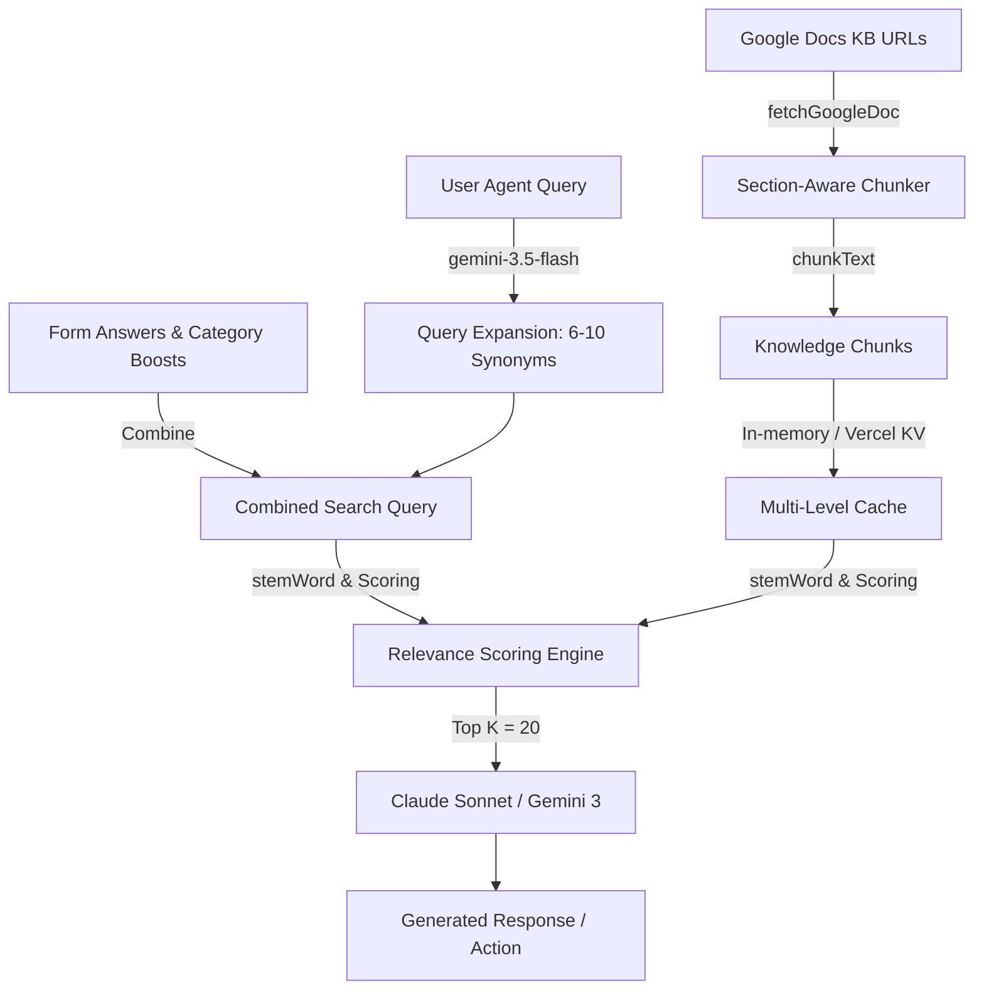

# Retrieval-Augmented Generation (RAG) Architecture

This document details the implementation of the Retrieval-Augmented Generation (RAG) system used in this project.

The system is a **custom, lightweight, in-memory, keyword-based search engine** built to query Google Docs knowledge bases. It bypasses semantic embeddings and vector databases in favor of a deterministic, TF-IDF-inspired keyword scoring algorithm optimized for speed, low dependency footprint, and predictability.

---

## 1. Flow Diagram

---

## 2. Component breakdown

### A. Document Ingestion & Chunking ([lib/drive.ts](file:///Users/admin/Documents/WintWealth/wint-ir-portal/lib/drive.ts))
*   **Document Fetching (`fetchGoogleDoc`)**: Fetches plain text exports or PDFs (using `pdf-parse`) from configured Google Drive URLs.
*   **Section-Aware Chunking (`chunkText`)**:
    *   Walks the document line-by-line to detect section boundaries using Markdown headers (`#`), numbered sections (`1.1`, `1.1.1`), type-code headers (`A1.`, `E1 —`), and ALL-CAPS lines.
    *   Prepares a breadcrumb path (e.g., `1. KYC > 1.1 AOF Status > 1.1.2 Expired`) and prefixes it to every chunk.
    *   Limits chunk size (default: 600 characters). If a section exceeds the limit, it splits on paragraph boundaries and carries the last paragraph over as overlap to ensure continuity.

### B. Multi-Level Caching ([lib/drive.ts](file:///Users/admin/Documents/WintWealth/wint-ir-portal/lib/drive.ts) & [lib/store.ts](file:///Users/admin/Documents/WintWealth/wint-ir-portal/lib/store.ts))
To prevent hitting Google Drive API rate limits and to optimize latency:
1.  **In-Memory Cache**: `global.__kbCache` holds chunks with a 30-minute Time-To-Live (TTL).
2.  **Vercel KV Store**: Persists chunks across serverless cold starts.
3.  **Google Docs Sync**: If both caches expire or miss, a fresh pull triggers and refreshes the caches.

### C. Query Distillment & Expansion ([app/api/chat/route.ts](file:///Users/admin/Documents/WintWealth/wint-ir-portal/app/api/chat/route.ts))
*   **Synonym Generation (`expandQuery`)**: Uses `gemini-3.5-flash` to extract core search intent from the user query, strip conversational noise, preserve named entities, handle negations, and map terms to 4-6 focused synonyms. It returns a space-separated string of 6-10 keywords.
*   **Form Answers & Category Boosting**:
    *   **Form Answers**: Incorporates keys and values from the user interface form to filter content.
    *   **Category Boosts**: Appends static, category-specific keywords (e.g., for `repayment`, `kyc`, `taxation`) directly targeting relevant document sections.

### D. Scoring & Matching Engine (`lib/drive.ts`)
*   **Word Stemming (`stemWord`)**: Uses a custom suffix-stripping stemmer to map words (like "pledging", "pledged") to their root ("pledg"). Both the query terms and chunk contents are stemmed before evaluation.
*   **Weighted Scoring Model**:
    *   **Header Matches**: Term occurrences in the breadcrumb prefix are multiplied by **3**.
    *   **Body Matches**: Term occurrences in the body text are multiplied by **1**.
    *   **Phrase Matches**: Sequential 2-word and 3-word combinations from the original query found in the chunk content are multiplied by **5**.
*   **Selection**: Sorts all chunks descending by relevance score and returns the top `K` (default 20) chunks. Even if the score is low, it returns the top chunks to allow the LLM to reason over them.
*   **Zero Score Fallback**: If the top score is `0` (no keyword overlap), the application triggers a Slack-based human fallback alert.
