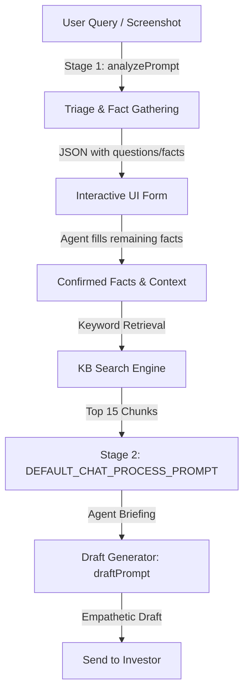
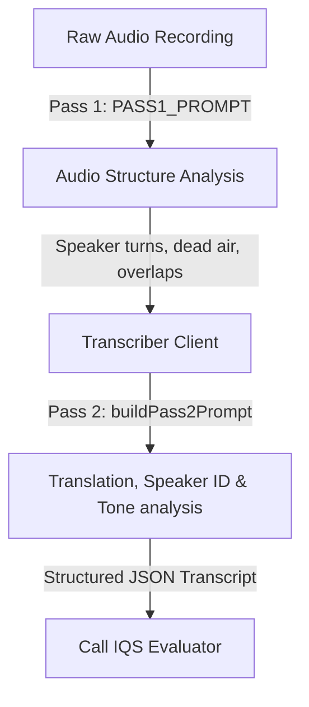

# Wint Wealth Investor Relations: Complete Call, Chat, & Quality Evaluation Guide

This document acts as a comprehensive reference guide for Prompt Engineers, QA Evaluators, and Developers. It details the complete end-to-end workflows for customer chat assistance, audio call analytics, and the Internal Quality Score (IQS) evaluation system for both chats and calls.

---

## 1. Customer Chat Assist Pipeline (Two-Stage RAG)

The chat assist pipeline is a real-time system that helps Support/IR agents answer user queries. It runs in two sequential stages: **Triage & Fact Gathering** followed by **Answer Generation**.



### Stage 1: Triage & Question Generator (Triage Layer)
* **Model**: `gemini-2.5-flash` (or `claude-sonnet-4-6` if LLM provider is set to Claude)
* **File Location**: [app/api/chat/analyze/route.ts](file:///Users/sivaranjini/Documents/wint/wint-ir-portal/app/api/chat/analyze/route.ts)
* **Prompt Source**: [PROMPT_analyze.txt](file:///Users/sivaranjini/Documents/wint/wint-ir-portal/PROMPT_analyze.txt)
* **Workflow**:
  1. The agent enters the customer's query or uploads a screenshot of the issue.
  2. The LLM classifies the query type into:
     - `direct`: Policy/Educational questions (resolved instantly without lookup).
     - `clarify`: Generates a message to ask for product clarification.
     - `process`: Multi-step issues depending on customer state (e.g. KYC, repayment).
  3. For `process` queries, the LLM walks a predefined schema for **10 categories**: Repayment, KYC, Payment, SIP, Sell/DDPI, Referral, Taxation, Dashboard, FD, and HUF.
  4. It extracts facts already mentioned (e.g. if the user says "Penny test failed" it maps `kyc_failing_step = Penny test failed`) and returns the next single unanswered question (with options) to the agent UI.
* **PII/Security Rules**: The LLM is strictly forbidden from asking for sensitive user information (like phone number, PAN, bank account digits, demat numbers, transaction UTRs). Instead, if these are needed for final resolution, it flags them in the final briefing as "collect from Finder CRM and include in escalation."

### Keyword Search & Retrieval (RAG Engine)
* **File Location**: [lib/drive.ts](file:///Users/sivaranjini/Documents/wint/wint-ir-portal/lib/drive.ts)
* **Workflow**:
  - Pulls and chunk files (PDFs, Google Docs, Word) from the shared Google Drive folder.
  - Generates query synonyms using `gemini-2.5-flash` to expand search keywords.
  - Scores knowledge base chunks using a custom suffix-stripping stemmer (`stemWord`) and weighted scoring:
    - **Header/Breadcrumb Matches**: `3x` weight.
    - **Body Matches**: `1x` weight.
    - **Sequential Phrase Matches** (2-word & 3-word): `5x` weight.
  - Returns the top 15-20 chunks for the LLM to analyze.

### Stage 2: Answer Generator (Chat Assistant)
* **Model**: `gemini-2.5-pro` (falls back to `gemini-2.5-flash` or uses `claude-sonnet-4-6`)
* **File Location**: [app/api/chat/route.ts](file:///Users/sivaranjini/Documents/wint/wint-ir-portal/app/api/chat/route.ts)
* **Prompt Source**: [PROMPT_chat.txt](file:///Users/sivaranjini/Documents/wint/wint-ir-portal/PROMPT_chat.txt)
* **Workflow**:
  1. Triggered once the agent confirms all the necessary facts from Stage 1.
  2. Synthesizes the facts, conversation history, and the top 15 retrieved knowledge base chunks.
  3. Maps the parameters to specific KB scenarios and outputs a strictly structured briefing for the agent.
* **Response Format**:
  ```text
  Block 1 — Tell the user: [exact message to relay] — 1-2 sentences only
  Block 2 — Agent actions: numbered Finder checks and internal steps
  Block 3 — Escalation: exact channel + POC + what to include (if needed)
  ```

### Chat Draft Generator
* **Model**: `gemini-2.5-flash`
* **File Location**: [app/api/chat/draft/route.ts](file:///Users/sivaranjini/Documents/wint/wint-ir-portal/app/api/chat/draft/route.ts)
* **Workflow**:
  - Takes the raw Stage 2 agent briefing and generates a ready-to-send draft message for the customer.
  - Enforces strict formatting rules: 3-5 sentences maximum, professional/empathetic tone, and must omit internal tools or terminology (such as CRM name `Finder` or Slack channel names like `#cx-ops`).

---

## 2. Audio & Call Analytics Workflow

For investor phone calls, the system processes raw call audio recordings through a two-pass pipeline to structure transcripts and analyze tone before running quality evaluation.



### Pass 1: Audio Structure Analysis
* **Model**: `gemini-2.5-flash` (with audio processing support)
* **File Location**: [lib/call-analyzer.ts#L250](file:///Users/sivaranjini/Documents/wint/wint-ir-portal/lib/call-analyzer.ts#L250)
* **Workflow**:
  - The model listens to the audio file **without transcribing words**.
  - It identifies structural events: speaker turns (labelled generically as `A` or `B`), dead air/silence (> 2.0 seconds), and speaker overlaps.
  - Outputs a structured JSON mapping of starts and ends.

### Pass 2: Transcription, Speaker ID & Tone Analysis
* **Model**: `gemini-2.5-flash` (or Claude equivalent)
* **File Location**: [lib/call-analyzer.ts#L294](file:///Users/sivaranjini/Documents/wint/wint-ir-portal/lib/call-analyzer.ts#L294)
* **Workflow**:
  - Receives the structural events from Pass 1.
  - Transcribes each speaker turn, automatically translating non-English segments (Hindi, Hinglish, Tamil, Telugu, etc.) to fluent English.
  - Determines roles (`IR_EXECUTIVE` vs `INVESTOR`) based on greeting signals (e.g. agent stating: "Hi, this is Priya from Wint Wealth").
  - Analyzes the **Tone & Dynamics** for each speaker turn:
    - **Sentiment**: positive, neutral, or negative.
    - **Aggression** (0-10): Calm (0) to Hostile (10).
    - **Confidence** (0-10, agent only): Directness and absence of hedging.
    - **Empathy** (0-10, agent only): Emotional validation and acknowledgement.
    - **Speech Speed**: slow, normal, or fast.
  - Classifies silence pauses into: `dead_air`, `processing_pause`, or `hold`.

---

## 3. Chat Internal Quality Score (IQS) Scoring System

The Chat IQS evaluator rates complete customer chat transcripts against **11 parameters** to assess agent performance.

* **Model**: `gemini-2.5-flash` (or `claude-sonnet-4-6`)
* **File Location**: [lib/quality.ts](file:///Users/sivaranjini/Documents/wint/wint-ir-portal/lib/quality.ts)
* **Scoring Prompt**: `IQS_SYSTEM_PROMPT` in `lib/quality.ts#L178`

### Scoring Formula
Each parameter is scored as `Yes` (pass), `No` (fail), or `NA` (not applicable). Parameters evaluated as `NA` are excluded from the calculation.

$$\text{IQS Score} = \left( \frac{\sum \text{Weights of "Yes" parameters}}{\sum \text{Weights of applicable ("Yes" + "No") parameters}} \right) \times 100$$

### Parameter Matrix & Weights

| Parameter (ID) | Weight | Parameter Description / Evaluation Criteria | Owner Group |
| :--- | :---: | :--- | :--- |
| **Technical** | 20% | Information must be technically, legally, and contractually accurate according to the KB. | CAT1 (QA-Owned) |
| **AllQuestions** | 10% | Did the agent answer all questions raised by the customer? | CAT1 (QA-Owned) |
| **Expectation** | 10% | Were clear timelines set for follow-ups or resolutions (ignoring past dates)? | CAT1 (QA-Owned) |
| **Contextual** | 10% | Was the advice tailored to the user's specific state rather than copy-pasting raw text? | CAT2 (TL-Owned) |
| **FollowUp** | 10% | Appropriate closing, offering further help, and executing necessary follow-up. | CAT1 (QA-Owned) |
| **Sentences** | 10% | Professional phrasing, tone, and format. | CAT2 (TL-Owned) |
| **Process** | 5% | Adherence to company workflows (e.g. escalations, check triggers). | CAT1 (QA-Owned) |
| **Opening** | 5% | Welcoming opening, correct greeting, and first response quality. | CAT1 (QA-Owned) |
| **Call** | 5% | Initiation of phone calls (only failed if called without request or reason). | CAT1 (QA-Owned) |
| **Grammar** | 5% | Vocabulary, syntax, spelling, and sentence structure. | CAT2 (TL-Owned) |
| **Empathy** | 10% | Active empathy, acknowledging frustration, and validating investor concerns. | CAT2 (TL-Owned) |

* **Ownership Groups**: 
  - **CAT1 (QA-Owned)**: Bots automatically evaluate these; Team Leads (TL) can dispute them but only QA admins can override.
  - **CAT2 (TL-Owned)**: Subjective communication parameters; TLs can directly override these scores.

### Key Evaluation Policies
To align the LLM scorer with human QA evaluations, the following rules are coded directly into the prompt:
1. **WhatsApp Rule**: Documents must **NEVER** be shared on WhatsApp. Agents redirecting customers to email is correct behavior.
2. **Form 121 / 15G/H**: Form 121 is the current standard. Directing users to submit directly with NBFCs/entities (when not supported on the app) is correct behavior.
3. **Settlement Timelines**: First investment is `T+3` working days; subsequent investments are `T+1` working days. Saturday/Sunday do not count.
4. **Internal CRM Checks**: Scorer must never assume an agent skipped Finder checks unless their response directly contradicts the database.
5. **Call Requests**: If a call occurred or was requested, the Call parameter must be scored as `NA` (since the audio recording needs independent scoring).

---

## 4. Call Internal Quality Score (IQS) Scoring System

Calls are evaluated on a separate script tailored to voice dynamics, conversational pacing, and listening skills.

* **Model**: `gemini-2.5-flash` / Claude
* **File Location**: [lib/call-quality.ts](file:///Users/sivaranjini/Documents/wint/wint-ir-portal/lib/call-quality.ts)
* **Scoring Prompt**: `CALL_IQS_SYSTEM_PROMPT` in `lib/call-quality.ts#L455`

### Parameter Matrix & Weights

| Parameter Group | Parameter | Weight | Evaluation Criteria |
| :--- | :--- | :---: | :--- |
| **Process (50%)** | CallOpening | 5% | Greeting, identifying self, and verifying caller identity. |
| | CallClosing | 5% | Closing greeting, asking if there are other queries. |
| | TechnicalLegal | 15% | Legal correctness and factual accuracy of information. |
| | AllQuestions | 10% | Addressing all user inquiries during the conversation. |
| | Expectation | 10% | Communicating clear timelines and SLAs. |
| | Process | 5% | Standard operating procedure checklist compliance. |
| **Communication (30%)** | Grammar | 10% | Vocabulary, structure, and pronunciations. |
| | Fillers | 10% | Minimal fumbling/stammering; avoidance of dead air. |
| | EnergyTone | 10% | Warmth, modulation, pace control, and enthusiasm. |
| **Customer Service (20%)**| ActiveListening| 10% | Avoiding talk-overs, matching pauses, and expressing empathy. |
| | Simplifying | 10% | Breaking complex financial concepts into simple terms. |

### Parameter Isolation Rule
To maintain statistical validity and scoring integrity, the model is strictly prohibited from cross-talking between parameters:
- The reasoning for Parameter A must **only** contain details relevant to Parameter A.
- Never mention the name of another parameter (e.g. evaluating active listening inside the TechnicalLegal score) to avoid cascading scoring failures.

---

## 5. Main Scoring Prompts Inventory

### Chat Quality Evaluator Prompt (`IQS_SYSTEM_PROMPT` snippet)
```text
You are the Wint Wealth Internal Quality Score (IQS) evaluator. You score customer support chat transcripts across 11 parameters.
[Rule: Read complete transcript first]
- You catch DEFINITIVE FAILURES, not imperfections.
- When in doubt, give the agent the benefit of the doubt -> score Yes.
- WhatsApp Rule: All documents only shared via email. WhatsApp share = fail.
- Settlement: First investment is T+3 working days, regular is T+1 working days.
- Output JSON format containing "scores", "reasoning", "kbCitation", "iqs_score", and "uncertain_parameters".
```

### Call Quality Evaluator Prompt (`CALL_IQS_SYSTEM_PROMPT` snippet)
```text
You are the Wint Wealth Call Quality evaluator. Score IR Executive voice call transcripts across 11 parameters.
The IR EXECUTIVE is the Wint Wealth agent. The INVESTOR is the customer.
[Rule: Read complete call transcript from segment [1] to end first]
[Rule: Parameter Isolation - never discuss other parameters inside a reasoning block]
- Simplify answers: check if financial jargon was translated to easy layperson terms.
- Fillers / Dead Air: check for stammering, repeats, and silences.
- Active Listening: score No if agent repeatedly cut off the investor.
```

### Audio Structure Analysis Prompt (`PASS1_PROMPT`)
```text
You are an audio structure analyser. Listen to the entire audio file.
Do NOT transcribe any words. Your only job is to detect and return:
1. SPEAKER TURNS: Every moment a different voice begins speaking.
2. SILENCE: Any gap of 2 seconds or more with no speech.
3. OVERLAP: Any moment where two voices speak simultaneously.
Return ONLY this JSON structure:
{
  "duration_seconds": 0.0,
  "events": [
    { "type": "turn", "speaker": "A" | "B", "start": 0.0, "end": 0.0 },
    ...
  ]
}
```
